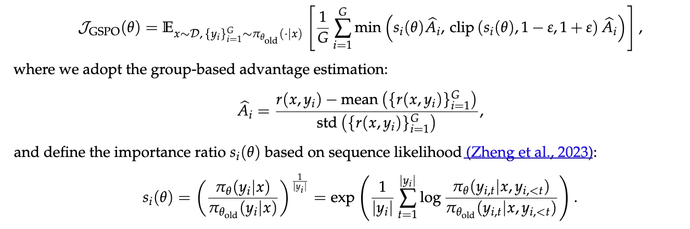

# Learn LLMs Only with Good Materials (Reasoning)

Updated on July 24, 2025 | Author: Xin Dong

--- 
## Framework 

[veRL](https://github.com/volcengine/verl/tree/main) 

I use veRL extensively in my research. It's a mature RL framework that handles most infrastructure issues for you. For example, it helps you allocate distributed GPU resources for different models involved in RL training, and it abstracts the RL training logic as simple sequential execution. 

This [video](https://appodzjvyp51702.xet.citv.cn/v3/course/alive/l_6821f9cee4b0694c5ad2531b?app_id=appodzjvyp51702&alive_mode=0&pro_id=&type=2) (in Chinese) gives a great introduction to veRL. 

## Can Base Models (Without RL Training) Actually Reason?

First, let's define what we mean by reasoning. 

In the context of LLMs, reasoning is the behavior where LLMs generate a sequence of *intermediate* tokens to better answer questions. These *intermediate* tokens can be interpretable, uninterpretable, or even completely non-human-readable [[Zhu et al., 2025](https://arxiv.org/pdf/2505.12514)]. 

The answer to this question is probably **Yes** – and honestly, that's not too surprising! 

Here's the key insight: when you compare pre-training and reinforcement learning (RL) training, one major difference is that RL uses free-form gradient descent (or ascent, depending on the sample's reward). RL calculates gradients with free-form self-generated data, while pre-training uses pre-defined data. As a result, as long as the pre-training corpus contains some reasoning-related data, the base model should learn to reason at some level. 

Danny Zhou gave an excellent talk on this topic in [Large Language Model Reasoning](https://dennyzhou.github.io/LLM-Reasoning-Stanford-CS-25.pdf) at [Stanford CS25](https://www.youtube.com/watch?v=ebnX5Ur1hBk). 

## Does RL Training Really Improve Reasoning?

WIP, stay tuned. 

## What is RL Training Actually Optimizing?

WIP, stay tuned. 

## Is GRPO Really Optimal?

GRPO [[DeepSeek-AI, 2024](https://arxiv.org/abs/2402.03300)], popularized by DeepSeek-R1, is widely used in the community as the de facto RL training method. 

<figure style="text-align: center; margin: 20px auto;">
  
  <figcaption style="color: #666; font-size: 0.9em; margin-top: 10px;"></figcaption>
</figure>

<figure style="text-align: center; margin: 20px auto;">
  
  <figcaption style="color: #666; font-size: 0.9em; margin-top: 10px;"></figcaption>
</figure>

$\pi_\theta(y_{i,t}|x,y_{i,<t})$ is the token-wise likelihood on one training sample $(x,y)$ where $x$ is the query and $y$ is the model's response. This term is *identical to* the pre-training loss. The difference is that GRPO involves two additional scaling factors: $\frac{1}{\pi_{\theta_\text{old}}(y_{i,t}|x,y_{i,<t})}$ and $\hat{A}_{i,t}$.

### Token-wise Impact on Training

#### Importance Sampling and Clipping
The theoretical justification for $\frac{1}{\pi_{\theta_\text{old}}(y_{i,t}|x,y_{i,<t})}$ is importance sampling, given that $(x, y_i)$ is sampled from $\pi_{\theta_\text{old}}$ but used to update $\pi_\theta$. However, the possible value of $\frac{1}{\pi_{\theta_\text{old}}(y_{i,t}|x,y_{i,<t})}$ ranges from 1 to $\infty$, which can introduce huge variance in the gradient. 

To mitigate this issue, GRPO uses a clipping technique to limit the value of $w_{i,t}(\theta)$ to a reasonable range. The impact of clipping is more like a token filtering mechanism. For example, when $\hat{A}_{i,t}>0$ and $w_{i,t}(\theta) > (1 + \epsilon)$ (where a typical value of $\epsilon$ is 0.2), the corresponding token $y_{i,t}$'s loss $\pi_\theta(y_{i,t}|x,y_{i,<t})$ won't be used in the gradient calculation. 

In practice, this clipping technique introduces an extra hyperparameter $\epsilon$. DAPO [[ByteDance Seed, 2025](https://arxiv.org/pdf/2503.14476)] discovered that using a higher clipping upper bound $1 + \epsilon=1.28$ can encourage the model to explore more aggressively and improve reasoning performance. This makes sense because it results in filtering fewer tokens where $\pi_\theta$ differs from $\pi_{\theta_\text{old}}$, which is usually termed *exploration* in RL.

#### Low-Probability Tokens Over-Dominate
Here's where things get interesting! Although GRPO filters out some tokens by clipping the importance sampling ratio $w_{i,t}(\theta)$, tokens with low probability still dominate the gradient, as revealed by [[Yang et al., 2025]](https://arxiv.org/pdf/2505.12929). 

<figure style="text-align: center; margin: 20px auto;">
  
  <figcaption style="color: #666; font-size: 0.9em; margin-top: 10px;">Do Not Let Low-Probability Tokens Over-Dominate in RL for LLMs, Yang et al., 2025</figcaption>
</figure>

Although low-probability tokens only account for 19.22% of the total tokens (a), their gradient norm makes up most of the total gradient norm (d). Another piece of evidence: if we only use the low-probability tokens' gradient to update the model, the model's change is still quite similar to using all tokens' gradients (e), while using only high-probability tokens' gradients leads to very different model updates (f). 

Why one may not want that low-probability tokens' gradients over-dominate? The concern is that tokens with high probability cannot be updated towards the right direction effectively. A simple fix proposed by [[Yang et al., 2025]](https://arxiv.org/pdf/2505.12929) is to separate low- and high-probability tokens into two groups and apply their gradients individually.

#### Sequence-wise Importance Sampling 

In GRPO, we scale the gradient of each token by $\frac{1}{\pi_{\theta_\text{old}}(y_{i,t}|x,y_{i,<t})}$, which could be problematic according to the above analysis. A straightforward fix is to scale all tokens in a sequence with the averaged $\frac{1}{\pi_{\theta_\text{old}}(y_{i,t}|x,y_{i,<t})}$ across all tokens in that sequence. 
(Let's not assume that the average must be the arithmetic mean.)

If we ignore the advantage and clipping, the loss of GRPO is: 

\[
    \mathcal{J}_{\text{GRPO}} = \frac{1}{|y_i|}\sum_{t=1}^{|y_i|} \frac{\pi_\theta(y_{i,t}|x,y_{i,<t})}{\pi_{\theta_\text{old}}(y_{i,t}|x,y_{i,<t})}
    \]

GSPO [[Zheng et al., 2025](https://arxiv.org/pdf/2507.18071)] proposed to change it to: 

\[  
    \begin{aligned}
    \mathcal{J}_{\text{GSPO}} &= \left(\frac{\pi_\theta(y_i|x)}{\pi_{\theta_\text{old}}(y_i|x)}\right)^{\frac{1}{|y_i|}} \\
    & = \left(\frac{\Pi_{t=1}^{|y_i|} \pi_\theta(y_{i,t}|x,y_{i,<t})}{\Pi_{t=1}^{|y_i|} \pi_{\theta_\text{old}}(y_{i,t}|x,y_{i,<t})}\right)^{\frac{1}{|y_i|}} \\
    & = \exp\left(\frac{1}{|y_i|}\log\left(
    \frac{\Pi_{t=1}^{|y_i|} \pi_\theta(y_{i,t}|x,y_{i,<t})}{\Pi_{t=1}^{|y_i|} \pi_{\theta_\text{old}}(y_{i,t}|x,y_{i,<t})}
    \right)\right) \\
    & = \exp\left(\frac{1}{|y_i|} \sum_{t=1}^{|y_i|} \log\left(
    \frac{ \pi_\theta(y_{i,t}|x,y_{i,<t})}{ \pi_{\theta_\text{old}}(y_{i,t}|x,y_{i,<t})}
    \right)\right)
    \end{aligned}
    \]

By comparing the loss of GRPO and GSPO, we can see that:

- GRPO is doing the **arithmetic mean** of $\frac{\pi_\theta(y_{i,t}|x,y_{i,<t})}{\pi_{\theta_\text{old}}(y_{i,t}|x,y_{i,<t})}$.

- GSPO is doing the **geometric mean** of $\frac{\pi_\theta(y_{i,t}|x,y_{i,<t})}{\pi_{\theta_\text{old}}(y_{i,t}|x,y_{i,<t})}$.

Compared to arithmetic mean, geometric mean is less sensitive to extreme outliers. 
To see this, let's consider a simpler example and exercise some high-school math! 

Suppose we have arithmetic mean and geometric mean losses over $\frac{f_\theta(x_i)}{a_i}$ where $a_i$ is a positive scalar: 

\[
\begin{aligned}
\mathcal{L}_\text{ari} &= \frac{1}{N} \sum_{i=1}^N \frac{f_\theta(x_i)}{a_i} \\
\mathcal{L}_\text{geo} &= \exp\left(\frac{1}{N} \sum_{i=1}^N \log\left(\frac{f_\theta(x_i)}{a_i}\right)\right) = \frac{\left({\Pi_{i=1}^N f_\theta(x_i)}\right)^{1/N}}{\left({\Pi_{i=1}^N a_i}\right)^{1/N}} 
\end{aligned} 
\]

The gradients of the two losses are: 

\[
\begin{aligned}
\nabla \mathcal{L}_\text{ari} &= \frac{1}{N} \sum_{i=1}^N \left( \frac{\nabla_\theta f_\theta(x_i)}{a_i} \right) \\
\nabla \mathcal{L}_\text{geo} &= \mathcal{L}_\text{geo} \cdot \frac{1}{N} \sum_{i=1}^N  \left(\frac{\nabla_\theta f_\theta(x_i)}{f_\theta(x_i)}\right) \\
&= \frac{\left({\Pi_{i=1}^N f_\theta(x_i)}\right)^{1/N}}{\left({\Pi_{i=1}^N a_i}\right)^{1/N}} \cdot \frac{1}{N} \sum_{i=1}^N  \left(\frac{\nabla_\theta f_\theta(x_i)}{f_\theta(x_i)}\right) \\
\end{aligned}
\]

or 

\[
\begin{aligned}
\nabla \mathcal{L}_\text{ari} &=  \frac{1}{N} \sum_{i=1}^N \left( \frac{f_\theta(x_i)}{a_i} \cdot \nabla_\theta \log f_\theta(x_i) \right) \\
\nabla \mathcal{L}_\text{geo} 
&= \frac{\left({\Pi_{i=1}^N f_\theta(x_i)}\right)^{1/N}}{\left({\Pi_{i=1}^N a_i}\right)^{1/N}} \cdot \frac{1}{N} \sum_{i=1}^N  \left(\nabla_\theta \log f_\theta(x_i)\right)
\end{aligned}
\]

We can clearly see that:
- In **arithmetic mean** loss, the gradient is a weighted average of individual gradients where the weights are $\frac{1}{a_i}$.

- In **geometric mean** loss, the gradient is a weighted average of individual gradients where the weights are $\frac{\left({\Pi_{i=1}^N f_\theta(x_i)}\right)^{1/N}}{\left({\Pi_{i=1}^N a_i}\right)^{1/N}} \cdot \frac{1}{f_\theta(x_i)}$.

or

- In **arithmetic mean** loss, the gradient is a weighted average of individual **log** gradients where the weights are $\frac{f_\theta(x_i)}{a_i}$.

- In **geometric mean** loss, the gradient is a weighted average of individual **log** gradients where the weights are all the same: $\frac{\left({\Pi_{i=1}^N f_\theta(x_i)}\right)^{1/N}}{\left({\Pi_{i=1}^N a_i}\right)^{1/N}}$.

The real loss of GSPO is:

<figure style="text-align: center; margin: 20px auto;">
  
  <figcaption style="color: #666; font-size: 0.9em; margin-top: 10px;">Group Sequence Policy Optimization, Zheng et al., 2025</figcaption>
</figure>

When we put the gradients of GRPO and GSPO together, we can see:

<figure style="text-align: center; margin: 20px auto;">
  
  <figcaption style="color: #666; font-size: 0.9em; margin-top: 10px;">Group Sequence Policy Optimization, Zheng et al., 2025</figcaption>
</figure>

<figure style="text-align: center; margin: 20px auto;">
  
  <figcaption style="color: #666; font-size: 0.9em; margin-top: 10px;">Group Sequence Policy Optimization, Zheng et al., 2025</figcaption>
</figure>

In GSPO, all tokens in a sequence share the same scaling factor $\left(\frac{\pi_\theta(y_i|x)}{\pi_{\theta_\text{old}}(y_i|x)}\right)^{\frac{1}{|y_i|}}$. 

#### High-Entropy Tokens Matter

Another line of work studies the impact of tokens from the perspective of token entropy. Note that the entropy of a token is defined as:

\[
    H(p)=-\sum_{i=1}^N p_i\log p_i,
    \]

given that the output probability of this token is $p\in\mathbb{R}^N$ where $N$ is the vocabulary size. 

If a token has 100% probability at the ground-truth index, its entropy is 0. However, if a token has low probability at the ground-truth index, its entropy can be high or low depending on the probability distribution of the other indices. But, in general, the entropy of low-probability tokens gets better chance to be high?

Many studies [[Wang et al., 2025](https://arxiv.org/pdf/2506.01939), [Wang et al., 2025](https://arxiv.org/pdf/2507.15778v1)] find that high-entropy tokens contribute significantly to the success of RL training.
Both studies discover that high-entropy tokens are usually words that connect reasoning steps and guide the model toward continuing the reasoning process.

<figure style="text-align: center; margin: 20px auto;">
  
  <figcaption style="color: #666; font-size: 0.9em; margin-top: 10px;">Beyond the 80/20 Rule, Wang et al., 2025</figcaption>
</figure>

These tokens that have high entropy and steer the reasoning path are called **forking tokens**.
[Wang et al., 2025](https://arxiv.org/pdf/2506.01939) found that utilizing only  top 20% high-entropy tokens' gradients achieves even better performance than full-gradient updates, and the performance gap is more significant when the model size is larger. At the same time, this method also increases the average response length, probably because of the emphasis on forking tokens. 

[Wang et al., 2025](https://arxiv.org/pdf/2507.15778v1) found a very similar phenomenon. 

<figure style="text-align: center; margin: 20px auto;">
  
  <figcaption style="color: #666; font-size: 0.9em; margin-top: 10px;">Stabilizing Knowledge, Promoting Reasoning: Dual-Token Constraints for RLVR, Wang et al., 2025</figcaption>
</figure>

They call high-entropy tokens **reasoning-related tokens** because these tokens act as logical connectors, and they call low-entropy tokens **knowledge-related tokens** because these tokens are usually words tied to factual knowledge (although I'm not sure if this is a great definition of 'knowledge'). 

The solution they proposed is to deal with these two types of tokens differently by using two sets of hyperparameters. Specifically, they use a larger $\epsilon$ and smaller coefficient of $\mathcal{D}_{\text{KL}}(\pi_\theta\|\pi_{\theta_\text{ref}})$ for reasoning-related tokens.