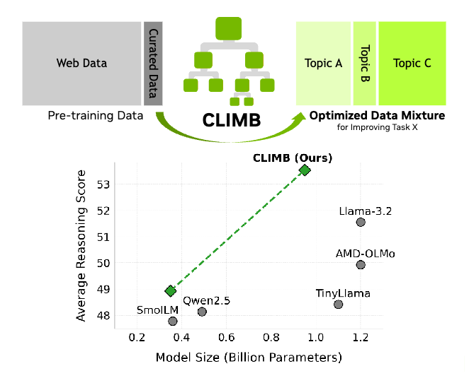
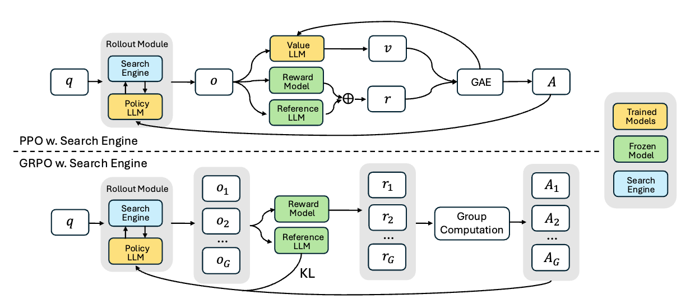
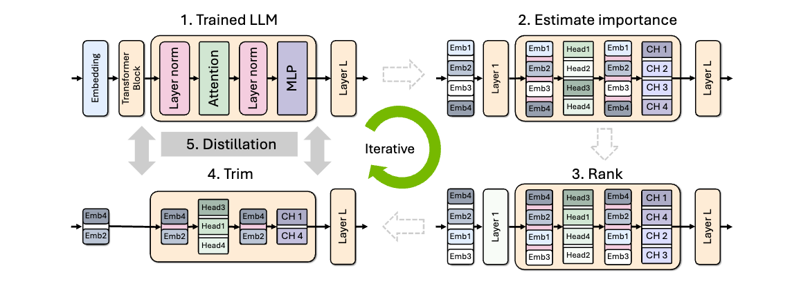

# From Giants to Geniuses: The Rise of Small Language Models

Published on May 18, 2025 | Author: Xin Dong

---

Scaling law [[Kaplan et al., 2020](https://arxiv.org/abs/2001.08361), [Hoffmann et al., 2022](https://arxiv.org/abs/2203.15556)] for language (and multi-modal) models may be the most important discovery in the past decade for AI. 
The scaling law states that the performance of a language model is proportional to the number of parameters in the model when you scale the training compute and data accordingly. 
In order to push the intelligence boundary, the community, including many well-known companies and institutions, have been working on building larger and larger models. Taking the open-weight models as an example, we have seen from `Llama 1` to `Llama 4` that the model size has increased from 65B [[Touvron et al., 2023](https://arxiv.org/abs/2302.13971)] to 2,000B [[Meta AI, 2025](https://www.llama.com/models/llama-4/)] parameters. 

So, two questions naturally come to mind:
> 1. Is there a wall for the scaling law and when will it hit the wall?
> 2. What about the opposite direction, where small language models are entering their own Cambrian explosion era?

For the first question, Ilya Sutskever's talk at NeurIPS 2024 ["Pre-training as we know it will end"](https://www.youtube.com/watch?v=1yvBqasHLZs&t=6s) offered an intriguing analogy: Internet data is the fossil fuel of AI. Fortunately, we discovered this resource and leveraged it to build large language models (LLMs). Unfortunately, we have only one Internet. In the second era of LLMs, reinforcement learning has illuminated a new path where models can be trained with experience and exploratory data generated by the models themselves [[DeepSeek-AI, 2025](https://arxiv.org/abs/2501.12948), [OpenAI o3, 2025](https://cdn.openai.com/pdf/2221c875-02dc-4789-800b-e7758f3722c1/o3-and-o4-mini-system-card.pdf)]. 

In this blog, we will focus on the second question where we show early signs and evidence for the Cambrian explosion of small language models. 

## Why Small Language Models?

The reasons why small language models are becoming more and more popular are quite straightforward: they are lightweight, fast, and economical. 

### Realtime

Building agents that can be integrated into real-world applications usually requires the model behind the agent to respond in low latency. Otherwise, the user experience and the agent's use scenario will be severely impacted. In addition, the test-time scaling (i.e., the long chain-of-thought) make this even more challenging. For example, DeepSeek-R1 achieves ~40ms per token on average with 8xNVIDIA H200 setup, using well-optimized SGLang inference engine [[DataCrunch, 2025](https://datacrunch.io/blog/deploy-deepseek-r1-on-8x-nvidia-h200?utm_source=chatgpt.com)]. Suppose 2000 tokens are required for an agent to understand what the next function call should be, the latency will be 80 seconds. 
If we can use a smaller language model, the latency can be reduced to within 1 second and make the agent more responsive. 

### Economic Inference 

Apparently, large language models suffer from not only high response latency but also substantial inference costs. As mentioned above, deploying the DeepSeek-R1 (671B) requires a cluster of eight NVIDIA H200 GPUs, costing approximately $60,000 per month. 

If the model is small enough to be deployed on a single (and consumer-grade) GPU, the inference cost and deployment cost will be significantly reduced for both the model provider and the users. In addition, this can also be a good way to achieve the decentralized inference and "AI for all". 

### Cost of Updating

Small language models are also more cost-effective to update. As agentic data continues to grow and new information becomes essential, models require frequent updates to remain relevant. For example, a coding assistant model needs updating whenever new developer documentation is released or when significant bugs are identified and fixed. 

### Models Router

Small language model can be used with large language models to enjoy the benefits of both. A model router can be used to dispatch the query to the appropriate model based on the query types, query diffculties, and model capabilities. In addition, small language models can also be used with other special-purpose (small) models in an Agent2Agent framework [[Google, 2025](https://developers.googleblog.com/en/a2a-a-new-era-of-agent-interoperability/)].

<!-- ### Acdemic Pancipation -->

## David vs. Goliath: Can Small Language Models Rise to the Challenge of Agentic Intelligence?

In recent months, several studies have shown that small language models can outperform their last-generation larger counterparts across various tasks.

Furthermore, as language models serve as foundational architectures for multimodal applications, we extend our analysis to include compact vision-language, speech, and world models that build upon these advances.

### Language Models

<table style="border-collapse: collapse; width: 100%; margin: 20px 0; font-size: 0.9em; font-family: inherit;">
  <tr style="background-color: #f2f2f2;">
    <th style="border: 1px solid #ddd; padding: 6px; text-align: center; font-weight: bold; font-size: 0.9em; width: 20%;">Model</th>
    <th style="border: 1px solid #ddd; padding: 6px; text-align: center; font-weight: bold; font-size: 0.9em; width: 15%;">Size</th>
    <th style="border: 1px solid #ddd; padding: 6px; text-align: center; font-weight: bold; font-size: 0.9em; width: 65%;">Performance</th>
  </tr>
  <tr>
    <td style="border: 1px solid #ddd; padding: 6px; text-align: center; font-size: 0.9em;"><a href="https://huggingface.co/meta-llama/Llama-3.2-3B">Llama-3.2</a></td>
    <td style="border: 1px solid #ddd; padding: 6px; text-align: center; font-size: 0.9em;">1B, 3B</td>
    <td style="border: 1px solid #ddd; padding: 6px; text-align: left; font-size: 0.9em;">Llama 3.2 is a collection of multilingual large language models. Comparing to GPT-3 (175B), Llama 3.2 3B achieve better MMLU score (58% vs 43.9%).</td>
  </tr>
  <tr style="background-color: #f9f9f9;">
    <td style="border: 1px solid #ddd; padding: 6px; text-align: center; font-size: 0.9em;"><a href="https://qwenlm.github.io/blog/qwen3/">Qwen-2.5 and -3</a></td>
    <td style="border: 1px solid #ddd; padding: 6px; text-align: center; font-size: 0.9em;">0.5B, 1.5B, 3B, 7B</td>
    <td style="border: 1px solid #ddd; padding: 6px; text-align: left; font-size: 0.9em;">Qwen serial small language models show stronger benchmark scores than Llama 3.2 and are widely used in the open-source community. It has great instruction following, structured output, role-playing, and reasoning capabilities. Despite their small sizes, all Qwen models are highly over-trained (more than 30 trillion tokens) if using the optimal compute standard in Chinchilla scaling law [<a href="https://arxiv.org/abs/2203.15556">Hoffmann et al., 2022</a>]. </td>
  </tr>
  <tr>
    <td style="border: 1px solid #ddd; padding: 6px; text-align: center; font-size: 0.9em;"><a href="https://huggingface.co/collections/deepseek-ai/deepseek-r1-678e1e131c0169c0bc89728d">DeepSeek-R1-Distill</a></td>
    <td style="border: 1px solid #ddd; padding: 6px; text-align: center; font-size: 0.9em;">1.5B, 7B</td>
    <td style="border: 1px solid #ddd; padding: 6px; text-align: left; font-size: 0.9em;">DeepSeek-R1-Distill demonstrates that the reasoning patterns of larger models can be distilled into smaller models, resulting in better performance compared to the reasoning patterns discovered through RL on small models. DeepSeek-R1-Distill-Qwen-7B model outperforms large proprietary models like Claude-3.5-Sonnet-1022 and GPT-4o-0513 on some tasks (e.g., AIME 2024 and Math-500)</td>
  </tr>
  <tr style="background-color: #f9f9f9;">
    <td style="border: 1px solid #ddd; padding: 6px; text-align: center; font-size: 0.9em;"><a href="https://huggingface.co/collections/HuggingFaceTB/smollm2-6723884218bcda64b34d7db9">SmolLM2</a></td>
    <td style="border: 1px solid #ddd; padding: 6px; text-align: center; font-size: 0.9em;">135M, 360M, 1.7B</td>
    <td style="border: 1px solid #ddd; padding: 6px; text-align: left; font-size: 0.9em;">SmolLM2 comprises a family of compact language models that excel at diverse tasks while remaining lightweight enough for on-device deployment. Trained on 11 trillion tokens from high-quality sources including FineWeb-Edu, DCLM, The Stack, and specialized mathematics and coding datasets (all publicly available). The instruct model additionally supports tasks such as text rewriting, summarization and function calling.</td>
  </tr>
  <tr>
    <td style="border: 1px solid #ddd; padding: 6px; text-align: center; font-size: 0.9em;"><a href="https://arxiv.org/pdf/2411.13676">Hymba</a></td>
    <td style="border: 1px solid #ddd; padding: 6px; text-align: center; font-size: 0.9em;">350M, 1.5B</td>
    <td style="border: 1px solid #ddd; padding: 6px; text-align: left; font-size: 0.9em;">Hymba is a family of small language models featuring a hybrid-head parallel architecture that integrates transformer attention mechanisms with state space models (SSMs) for enhanced efficiency. Hymba-1.5B-Base model surpasses sub-2B public models (e.g., Qwen-2.5) in performance and even outperforms Llama-3.2-3B with 1.32% higher average accuracy, an 11.67× cache size reduction, and 3.49× throughput.</td>
  </tr>
</table>

### Vision-Language Models
A lot of vision-language models (VLMs) are actually finetuned from small language models. 

<table style="border-collapse: collapse; width: 100%; margin: 20px 0; font-size: 0.9em; font-family: inherit;">
  <tr style="background-color: #f2f2f2;">
    <th style="border: 1px solid #ddd; padding: 6px; text-align: center; font-weight: bold; font-size: 0.9em; width: 20%;">Model</th>
    <th style="border: 1px solid #ddd; padding: 6px; text-align: center; font-weight: bold; font-size: 0.9em; width: 15%;">Size</th>
    <th style="border: 1px solid #ddd; padding: 6px; text-align: center; font-weight: bold; font-size: 0.9em; width: 65%;">Performance</th>
  </tr>
  <tr>
    <td style="border: 1px solid #ddd; padding: 6px; text-align: center; font-size: 0.9em;"><a href="https://github.com/QwenLM/Qwen2.5-VL">Qwen2.5-VL</a></td>
    <td style="border: 1px solid #ddd; padding: 6px; text-align: center; font-size: 0.9em;">3B, 7B</td>
    <td style="border: 1px solid #ddd; padding: 6px; text-align: left; font-size: 0.9em;">Qwen2-VL represents a comprehensive family of vision-language models ranging from 3B to 72B parameters, with the 3B and 7B variants being particularly popular on Hugging Face. These models excel at visual understanding tasks and demonstrate strong capabilities in vision-based agent interactions, making them ideal for computer vision applications and visual reasoning tasks.</td>
  </tr>
  <tr style="background-color: #f9f9f9;">
    <td style="border: 1px solid #ddd; padding: 6px; text-align: center; font-size: 0.9em;"><a href="https://arxiv.org/abs/2412.04468">NVILA</a></td>
    <td style="border: 1px solid #ddd; padding: 6px; text-align: center; font-size: 0.9em;">3B, 8B</td>
    <td style="border: 1px solid #ddd; padding: 6px; text-align: left; font-size: 0.9em;">NVILA introduces an innovative family of open-source vision-language models that optimize the efficiency-accuracy trade-off. Extending VILA's architecture, NVILA employs a novel "scale-then-compress" methodology: it first enhances spatial and temporal resolutions before applying token compression. This approach enables efficient processing of high-resolution images and extended video sequences while maintaining computational efficiency.</td>
  </tr>
  <tr>
    <td style="border: 1px solid #ddd; padding: 6px; text-align: center; font-size: 0.9em;"><a href="https://huggingface.co/collections/nvidia/eagle-2-6764ba887fa1ef387f7df067">Eagle2</a></td>
    <td style="border: 1px solid #ddd; padding: 6px; text-align: center; font-size: 0.9em;">1B, 2B, 9B</td>
    <td style="border: 1px solid #ddd; padding: 6px; text-align: left; font-size: 0.9em;">Eagle 2 is a family of frontier vision-language models with vision-centric design. The model supports 4K HD input, long-context video, and grounding. Eagle2 posits that data is the most decisive factor to obtain high-quality models and follows the principle “Diversity first, then quality” to build VLM post-training dataset.</td>
  </tr>
  <tr style="background-color: #f9f9f9;">
    <td style="border: 1px solid #ddd; padding: 6px; text-align: center; font-size: 0.9em;"><a href="https://huggingface.co/collections/HuggingFaceTB/smolvlm-6740bd584b2dcbf51ecb1f39">SmolVLM</a></td>
    <td style="border: 1px solid #ddd; padding: 6px; text-align: center; font-size: 0.9em;">2B</td>
    <td style="border: 1px solid #ddd; padding: 6px; text-align: left; font-size: 0.9em;">SmolVLM can answer questions about images, describe visual content, create stories grounded on multiple images, or function as a pure language model without visual inputs.</td>
  </tr>
</table>

### Speech Models

<table style="border-collapse: collapse; width: 100%; margin: 20px 0; font-size: 0.9em; font-family: inherit;">
  <tr style="background-color: #f2f2f2;">
    <th style="border: 1px solid #ddd; padding: 6px; text-align: center; font-weight: bold; font-size: 0.9em; width: 20%;">Model</th>
    <th style="border: 1px solid #ddd; padding: 6px; text-align: center; font-weight: bold; font-size: 0.9em; width: 15%;">Size</th>
    <th style="border: 1px solid #ddd; padding: 6px; text-align: center; font-weight: bold; font-size: 0.9em; width: 65%;">Performance</th>
  </tr>
  <tr>
    <td style="border: 1px solid #ddd; padding: 6px; text-align: center; font-size: 0.9em;"><a href="https://canopylabs.ai/model-releases">Orpheus</a></td>
    <td style="border: 1px solid #ddd; padding: 6px; text-align: center; font-size: 0.9em;">150M, 400M, 1B, 3B</td>
    <td style="border: 1px solid #ddd; padding: 6px; text-align: left; font-size: 0.9em;">Orpheus is a serial of open-source TTS models that exceed the capabilities of both open and closed-source models such as ElevenLabs and OpenAI. Orpheus models are based on the Llama architecture.</td>
  </tr>
  <tr style="background-color: #f9f9f9;">
    <td style="border: 1px solid #ddd; padding: 6px; text-align: center; font-size: 0.9em;"><a href="https://huggingface.co/nari-labs/Dia-1.6B">Dia</a></td>
    <td style="border: 1px solid #ddd; padding: 6px; text-align: center; font-size: 0.9em;">1.6B</td>
    <td style="border: 1px solid #ddd; padding: 6px; text-align: left; font-size: 0.9em;">Dia specializes in generating naturalistic dialogue from transcripts with audio-conditioned output capabilities. The model offers fine-grained control over emotional expression and tonal qualities, while also accurately synthesizing paralinguistic features such as laughter, coughing, and throat-clearing for enhanced conversational realism.</td>
  </tr>
  <tr>
    <td style="border: 1px solid #ddd; padding: 6px; text-align: center; font-size: 0.9em;"><a href="https://huggingface.co/sesame/csm-1b">CSM</a></td>
    <td style="border: 1px solid #ddd; padding: 6px; text-align: center; font-size: 0.9em;">1B</td>
    <td style="border: 1px solid #ddd; padding: 6px; text-align: left; font-size: 0.9em;">CSM (Conversational Speech Model) is a speech generation model from Sesame that generates RVQ audio codes from text and audio inputs. The model architecture employs a Llama backbone and a smaller audio decoder that produces Mimi audio codes. A fine-tuned variant of CSM powers the <a href="https://www.sesame.com/research/crossing_the_uncanny_valley_of_voice#demo">interactive voice demo</a>.</td>
  </tr>
  <tr>
    <td style="border: 1px solid #ddd; padding: 6px; text-align: center; font-size: 0.9em;"><a href="https://huggingface.co/nvidia/parakeet-tdt-0.6b-v2">Parakeet TDT </a></td>
    <td style="border: 1px solid #ddd; padding: 6px; text-align: center; font-size: 0.9em;">600M</td>
    <td style="border: 1px solid #ddd; padding: 6px; text-align: left; font-size: 0.9em;">It is the BEST Speech Recognition model on Open ASR Leaderboard and can transcribe 60 minutes of audio in 1 second.</td>
  </tr>  
</table>

### World Models 

<table style="border-collapse: collapse; width: 100%; margin: 20px 0; font-size: 0.9em; font-family: inherit;">
  <tr style="background-color: #f2f2f2;">
    <th style="border: 1px solid #ddd; padding: 6px; text-align: center; font-weight: bold; font-size: 0.9em; width: 20%;">Model</th>
    <th style="border: 1px solid #ddd; padding: 6px; text-align: center; font-weight: bold; font-size: 0.9em; width: 15%;">Size</th>
    <th style="border: 1px solid #ddd; padding: 6px; text-align: center; font-weight: bold; font-size: 0.9em; width: 65%;">Performance</th>
  </tr>
  <tr>
    <td style="border: 1px solid #ddd; padding: 6px; text-align: center; font-size: 0.9em;"><a href="https://huggingface.co/collections/nvidia/cosmos-6751e884dc10e013a0a0d8e6">Cosmos</a></td>
    <td style="border: 1px solid #ddd; padding: 6px; text-align: center; font-size: 0.9em;">4B, 5B, 7B</td>
    <td style="border: 1px solid #ddd; padding: 6px; text-align: left; font-size: 0.9em;">Cosmos is a family of pre-trained world foundation models purpose-built for generating physics-aware videos and world states for physical AI development. It has a collection of diffusion-based and autoregressive-based world foundation models that generate dynamic, high quality videos from text, image, or video inputs.</td>
  </tr>
  <tr style="background-color: #f9f9f9;">
    <td style="border: 1px solid #ddd; padding: 6px; text-align: center; font-size: 0.9em;"><a href="https://github.com/Wan-Video/Wan2.1">Wan</a></td>
    <td style="border: 1px solid #ddd; padding: 6px; text-align: center; font-size: 0.9em;">1.3B</td>
    <td style="border: 1px solid #ddd; padding: 6px; text-align: left; font-size: 0.9em;">Wan2.1-VACE provides solutions for various tasks, including reference-to-video generation (R2V), video-to-video editing (V2V), and masked video-to-video editing (MV2V), allowing creators to freely combine these capabilities to achieve complex tasks. It also has a 14B version.</td>
  </tr>
</table>

## How to Build (Better) Small Language Models?

### Better Data Quality and Diversity

Data quality and composition are crucial factors in training high-performing language models. This becomes even more critical for smaller models, as they have limited parameter space to accommodate data noise and store knowledge from pre-training corpora. CLIMB [[Diao et al., 2025](https://arxiv.org/abs/2504.13161)] addresses this challenge by embedding and clustering large-scale datasets in a semantic space, then iteratively searching for optimal mixtures. Through this process, it filters out noisy data to create a compact yet powerful 400-billion-token dataset optimized for efficient pre-training, ultimately delivering superior performance. These findings highlight the significant potential of data-driven optimization techniques in developing effective small language models.

<figure style="text-align: center; margin: 20px auto;">
  
  <figcaption style="color: #666; font-size: 0.9em; margin-top: 10px;">Figure 1: CLIMB's cLustering-based iterative data mixture optimization.</figcaption>
</figure>

### Reinforcement Learning 

Recent model pruning studies, including "The Cost of Scaling Down [[Jin et al., 2024](https://openreview.net/pdf?id=ldJXXxPE0L)] and The Journey Matters [[Jin et al., 2025](https://arxiv.org/pdf/2501.12486)], demonstrate that a model's capacity to store factual knowledge directly correlates with its parameter size. This suggests there may be an upper limit to the amount of information a small language model can retain in its weights. Given this constraint, function calling and tool utilization become crucial for small language models to effectively handle real-world agentic tasks.

Reinforcement Learning (RL) has emerged as a powerful paradigm for enhancing LLMs' reasoning capabilities. DeepSeek-R1 has successfully leveraged RL techniques, such as PPO [[Schulman et al., 2017](https://arxiv.org/abs/1707.06347)] and GRPO [[Shao et al., 2024](https://arxiv.org/abs/2402.03300)], to enhance logical inference and problem-solving abilities through experience-based learning. Following this approach, RL shows promising potential for improving small language models' function calling and tool utilization capabilities. For instance, Search-R1 [[Jin et al., 2025](https://arxiv.org/pdf/2503.09516)], which trains LLMs to reason and leverage search engines through RL, demonstrates significant improvements over various RAG baselines—achieving 41% better performance with Qwen2.5-7B and 20% with Qwen2.5-3B.

<figure style="text-align: center; margin: 20px auto;">
  
  <figcaption style="color: #666; font-size: 0.9em; margin-top: 10px;">Figure 2: Demonstration of PPO and GRPO training with the search engine (SEARCH-R1)</figcaption>
</figure>

### Distillation

Knowledge distillation (KD) is a technique that leveraging a large model's generation or output logits to guide the training of a smaller model. It has been widely used since the era of deep convolutional neural networks (CNNs). KD is still beneficial for small language models training. Many companies could probably already extensively use KD to train their small language models, for example, OpenAI's mini serial models (GPT-4o-mini, o3-mini, etc.) and Meta's Llama-3.2 serial although they did not explicitly mention it in details. The recent Qwen3 technical report [[Qwen Team, 2025](https://arxiv.org/pdf/2505.09388)] mentions that they use both "off-policy" (input data is from teacher model's generation) and "on-policy" (input data is from student model's generation) distillation methods to train small language models by aligning small model's logits with those of a teacher model to minimize the KL divergence. 

<figure style="text-align: center; margin: 20px auto;">
  
  <figcaption style="color: #666; font-size: 0.9em; margin-top: 10px;">Figure 3: High-level overview of Minitron's iterative pruning and distillation approach to train a family of smaller LLMs.</figcaption>
</figure>

In addition, NVIDIA also develops a pruning-and-distillation pipeline to compress a large model into a small one called Minitron [[Muralidharan et al., 2024](https://arxiv.org/abs/2407.14679)], where they show that distillation significantly boosts the performance of the compressed model.

## What's for Future?

As we have seen, the scaling law's slope for small language models is much steeper than expected. It is possible that their performance will continue to improve as innovation progresses. Eventually, small language models' capabilities will exceed the requirements of many agentic workflows, contributing tremendously to the advancement of agentic intelligence.

To conclude, I would like to explore several open research questions for small language models:

* What are the fundamental differences between small and large language models? Beyond information storage capacity (memorization), how do their generalization and reasoning capabilities differ?

* How can we effectively distill large language models' capabilities into small language models across different stages, including pre-training, SFT, and reinforcement learning?

* Can we use reinforcement learning to create a model zoo of small language models that specialize in different domains and collaborate with each other?

* While we still embrace scaling laws even with small language models, how can we achieve the paradigm of "train large, inference small"?

* How can we optimize hardware-software co-design to unlock the full efficiency potential of small language models on consumer-grade devices?

